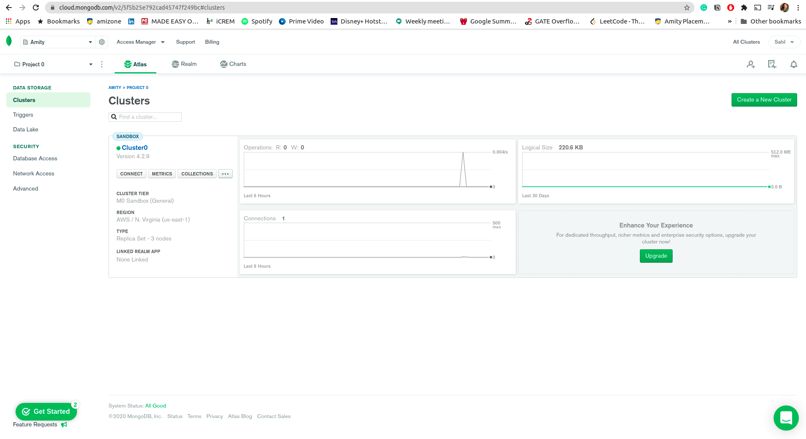
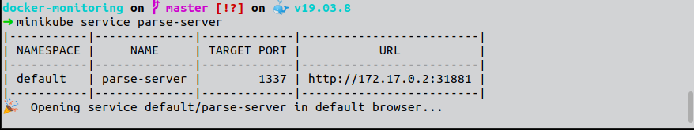
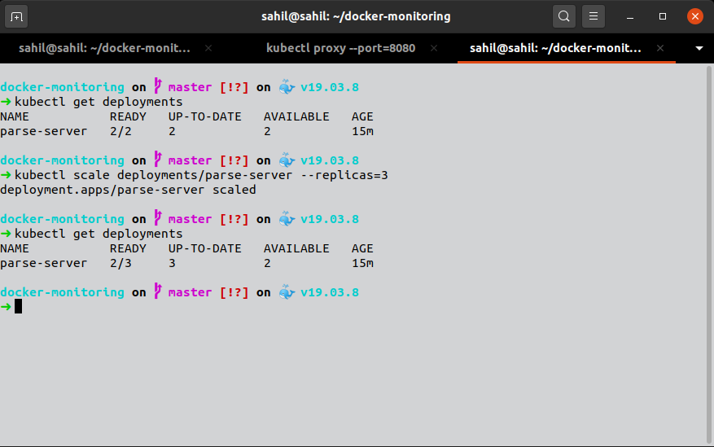
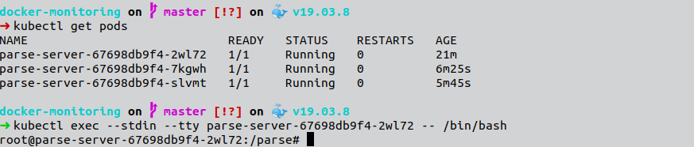
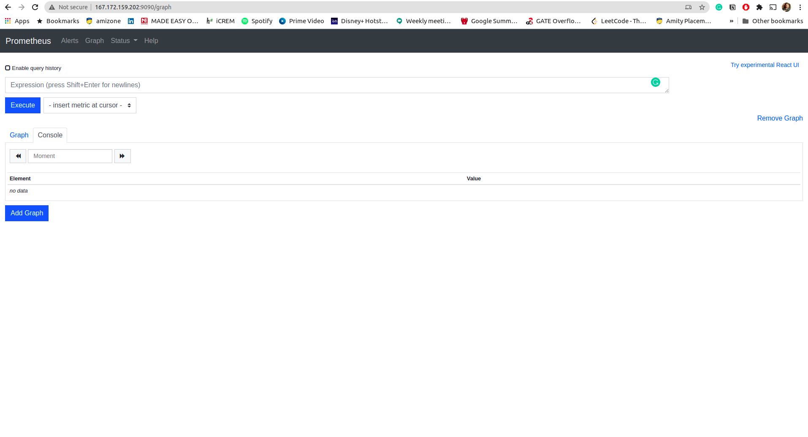
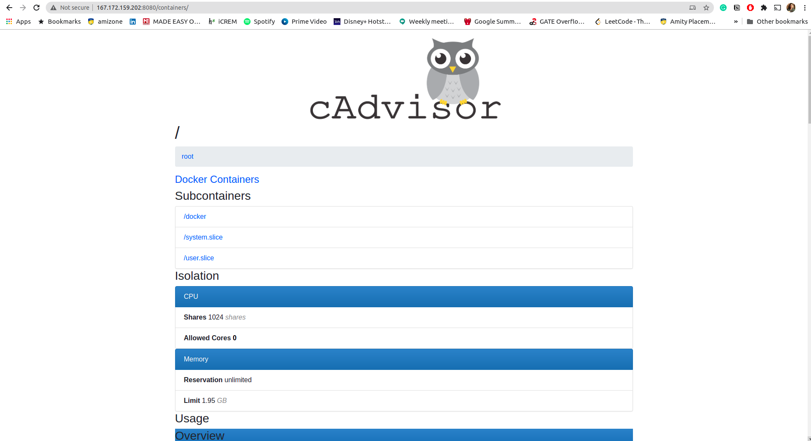
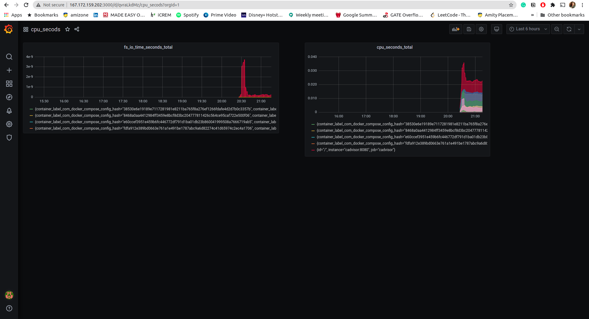

[](https://opensource.org/licenses/MIT)
[](https://twitter.com/sjha2048)

<div align="center">
    <a href="https://summerofcode.withgoogle.com/projects/#6091933446832128"></a>
    <h2>
On-premise Deployments with Dokku  
    </h2>
</div>


<p align="center">
	Check out my <a href="https://medium.com/stray-stream/">blog</a> or follow me on <a href="https://twitter.com/sjha2048">Twitter</a> for more updates.
</p>
<br>


<h2>1. Problem Statement  </h2>

Our main goal is to deploy and manage microwebservices individually for our enterprise. Here we are taking an example of a containerized web application as a single microservice [Parse Server Example](https://github.com/parse-community/parse-server-example), we want to deploy it on a cluster of machines, these can be virtual machines on the cloud or enterprise-level client-managed hardware.

<h2>2. Tools used w/ Installation instruction  </h2>

Here is the list of tools with official installation guides which I have/tried to use 

- [Docker](https://docs.docker.com/engine/install/)
- [Docker-compose](https://docs.docker.com/compose/install/)
- [Dokku](http://dokku.viewdocs.io/dokku/getting-started/installation/)
- [Prometheus](https://prometheus.io/download/)
- [Grafana](https://grafana.com/grafana/download)
- [Helm](https://helm.sh/docs/)
- [Kubernetes](https://kubernetes.io/docs/tutorials/hello-minikube/)
- [Kompose](https://kompose.io/installation/)

#### Predeployment Setup
As mentioned in the problem statement, we can use cloud VMs or enterprise-level client-managed hardware; for the sake of simplicity let's use a [custom image](https://marketplace.digitalocean.com/apps/dokku) provided by [digital ocean](https://www.digitalocean.com/) which already has dokku and docker installed. 

<div align="center">

</div>

Also our application depends on MongoDB, so let's create one Atlas cluster and fetch the required Database URI for connecting the db to our application.

<div align="center">

</div>


<h2>3. What sorcery is dokku </h2>

<div align="center">

</div>

According to the official documentation, they describe dokku as:

> Powered by Docker, you can install Dokku on any hardware. Use it on inexpensive cloud providers. Use the extra cash to buy a pony or feed kittens. You'll save tens of dollars a year on your dog photo sharing website.

In easy words, I like to refer it as my own personal [Heroku](https://www.heroku.com/).

## Why Use Dokku?

<div align="center">

</div>

- ##### Own PaaS at a fraction of a cost 
- ##### Great for Incremental remotely triggered application updates 
    - as simple as
      > ```git push dokku```
- ##### Own custom buildpacks 
- ##### Ease of Deployment 
- ##### Support for remote debugging 
- ##### I just wanted to try it out 😉

<h2>4. Let's get started 🚀</h2>

We can create a new application on our Dokku server which is hosted on a digital ocean instance

### pre deployment setup 

```
dokku apps:create parse-server-example 
```

We don't need to set up port here, Dokku will do this for us 

### deployment 

we can fetch our docker hub image which is pushed with the help of a github action which can be found [here](https://github.com/sjha2048/parse_server_atlan_task/blob/master/.github/workflows/docker.yml) after each commit. 

- pull the image 
   > ```docker pull sjha2048/parse_dokku```
- retag the image 
   > ```docker tag sjha2048/parse_dokku:latest dokku/parse-server-example```
- deploy tag
   > ```dokku tags:deploy parse-server-example latest```

### And terminé!!! 

Our server is up and running, and can be accessed at [167.172.159.202:1337/test](http://167.172.159.202:1337/test)

<div align="center">

</div>

### Alternatively 
We can use Kubernetes to create our deployment, follow these steps.

1. Create a deployment using our Docker image 
   ```
   kubectl create deployment parse-server --image=sjha2048/parse_dokku
   ```
2. Expose the Pod to the public internet using the kubectl expose command.
   ```
   kubectl expose deployment parse-server --type=LoadBalancer --port=1337
   ```

and now we can view our service with 

```
minikube service parse-server
```

<div align="center">

</div>

### Scaling 

we have [DOKKU_SCALE](https://github.com/sjha2048/parse_server_atlan_task/blob/master/DOKKU_SCALE) in which we can specify total number of instances we want by default we have one container running for each service 

```
web=1
parsedb=1
```

#### Scaling Our Kubernetes Deployment

We can easily scale our deployment using the following command 

```
kubectl scale deployments/parse-server --replicas=3
```
<div align="center">

</div>

<h2>5. Incremental remotely triggered application updates 🕹️</h2>

For application updates following workflow is described with this solution 

We can setup/extend our existing github action to deploy changes as soon as they are pushed, here's how we can set it up. 

```
steps:
  - uses: actions/checkout@v2
    with:
        fetch-depth: 0
  - id: deploy
    name: Deploy to dokku
    uses: idoberko2/dokku-deploy-github-action@v1
    with:
        ssh-private-key: ${{ secrets.SSH_PRIVATE_KEY }}
        dokku-host: '<digital-ocean server url>'
        app-name: 'parse-server-example'
```

<h2>6. Remote Debugging  </h2>

Dokku commands can be run over SSH. Anywhere you would run 

```dokku <command>``` 

just run 

```ssh -t dokku@dokku.me <command>```

for acessing the shell of our Kubernetes deployment we can use [telepresence](https://www.telepresence.io/reference/install) to gain remote access for use following command locally inside the instance

```
kubectl exec --stdin --tty parse-server -- /bin/bash
```

<div align="center">

</div>
we'll cover this in detail in "Health Alerts and Monitoring" section as it will give us a plethora of information to analyze our containers metrics.

<h2>7. Health Alerts and Monitoring 🩺 </h2>

Let's get started with the scary part (atleast for me ;__;), So, these are our today's actors:

- [Prometheus](), for scraping data from various sources
- [Node Exporter](), for providing the data about host machine to Prometheus 
- [cAdvisor](), for providing Prometheus data about running containers
- [Grafana](), for visualizing the data from Prometheus

Installing Prometheus 🔥

```
dokku apps:create prometheus

docker image pull prom/prometheus:v2.15.2
docker image tag prom/prometheus:v2.15.2 dokku/prometheus:2.15.2
```

Setting up the configuration

```
dokku config:set prometheus DOKKU_DOCKERFILE_START_CMD="--config.file=/etc/prometheus/prometheus.yml --storage.tsdb.path=/prometheus --web.console.libraries=/usr/share/prometheus/console_libraries --web.console.templates=/usr/share/prometheus/consoles --web.enable-lifecycle"
```

Access it [here](http://167.172.159.202:9090/graph)

<div align="center">

</div>

Raising Node Exporter up 🙌

```
dokku apps:create node-exporter

docker image pull prom/node-exporter:v0.18.1
docker image tag prom/node-exporter:v0.18.1 dokku/node-exporter:0.18.1

dokku config:set node-exporter DOKKU_DOCKERFILE_START_CMD="--collector.textfile.directory=/data --path.procfs=/host/proc --path.sysfs=/host/sys"

dokku storage:mount node-exporter /proc:/host/proc:ro 
dokku storage:mount node-exporter /:/rootfs:ro 
dokku storage:mount node-exporter /sys:/host/sys:ro 
dokku storage:mount node-exporter /var/lib/dokku/data/storage/node-exporter:/data

sudo mkdir -p /var/lib/dokku/data/storage/node-exporter
sudo chown nobody:nogroup /var/lib/dokku/data/storage/node-exporter

dokku docker-options:add node-exporter deploy "--net=host"
dokku checks:disable node-exporter
```

Let's invite cAdvisor to the party 🥳

```
dokku apps:create cadvisor

docker image pull gcr.io/google-containers/cadvisor:v0.35.0
docker image tag gcr.io/google-containers/cadvisor:v0.35.0 dokku/cadvisor:0.35.0

dokku config:set cadvisor DOKKU_DOCKERFILE_START_CMD="--docker_only --housekeeping_interval=10s --max_housekeeping_interval=60s --disable_metrics=disk"

dokku storage:mount cadvisor /:/rootfs:ro 
dokku storage:mount cadvisor /sys:/sys:ro 
dokku storage:mount cadvisor /var/lib/docker:/var/lib/docker:ro 
dokku storage:mount cadvisor /var/run:/var/run:rw

dokku tags:deploy cadvisor 0.35.0
dokku proxy:ports-set cadvisor http:80:8080
dokku letsencrypt cadvisor
dokku http-auth:on cadvisor <username> <password>
```

Access it [here](http://167.172.159.202:8080/containers/)

<div align="center">

</div>

Visualizing this black magic with Grafana 📈

```
dokku apps:create grafana

docker image pull grafana/grafana:6.6.1
docker image tag grafana/grafana:6.6.1 dokku/grafana:6.6.1

dokku storage:mount grafana /var/lib/dokku/data/storage/grafana:/var/lib/grafana
sudo mkdir /var/lib/dokku/data/storage/grafana
sudo chown 472:472 /var/lib/dokku/data/storage/grafana

dokku tags:deploy grafana 6.6.1
dokku proxy:ports-set grafana http:80:3000
dokku letsencrypt grafana
```

Now we can add Prometheus as a datasource in our Grafana dashboard and give ourselves a praise 

Here's the grafana dashboard with fs_io_time_seconds_total and cpu_seconds_total metrics you can access it [here](http://167.172.159.202:3000/)

<div align="center">

</div>


### Ps: We could have bootstraped our application health monitoring tools with the help of docker-compose 

Here's how 

```
version: '3.2'
services:
  parse:
    image: sjha2048/parse_dokku
    container_name: parsedb
    ports:
    - 1337:1337
  prometheus:
    image: prom/prometheus:latest
    container_name: prometheus
    ports:
    - 9090:9090
    command:
    - --config.file=/etc/prometheus/prometheus.yml
    volumes:
    - ./prometheus.yml:/etc/prometheus/prometheus.yml:ro
    depends_on:
    - cadvisor
  cadvisor:
    image: gcr.io/google-containers/cadvisor:latest
    container_name: cadvisor
    ports:
    - 8080:8080
    volumes:
    - /:/rootfs:ro
    - /var/run:/var/run:rw
    - /sys:/sys:ro
    - /var/lib/docker/:/var/lib/docker:ro
    depends_on:
    - redis
  redis:
    image: redis:latest
    container_name: redis
    ports:
    - 6379:6379
```

we can simply run it by:

```
docker-compose up 
```


<h2>8. Application Security (with source code protection) 🔒 </h2>

We can add SSL to our parse server, with the help of [Dokku LetsEncrypt Plugin](https://github.com/dokku/dokku-letsencrypt)
it's easy to setup 

```
dokku plugin:install https://github.com/dokku/dokku-letsencrypt.git
dokku config:set --no-restart myapp DOKKU_LETSENCRYPT_EMAIL=<EMAIL>
dokku letsencrypt parse-server-example
```
<h2>9. Disaster management  🛅</h2>

Because Dokku is git based, rebuilding a deployed app is as easy as pushing from git. We can push to a new server by updating the dokku remote in our local app's repo.

```
git remote rm dokku
git remote add dokku dokku@[dokku.me:dokku.me]
git push dokku [master]
```

### Disaster Recovery 

The best plan for disaster recovery in Dokku is to always keep multiple copies (remote) of our local repo, static assets and periodic database dumps, in case if our git repo and all the backups are completely lost, we can recover the last pushed copy from our remote Dokku server (only if the ssh key is still with you)

```
mkdir [app-name] ; cd !$
git init && git remote add dokku dokku@[dokku.me:app-name]
git pull dokku/master && git checkout dokku/master
```

<h2>10 (a). Zero Downtime deployment with Dokku 0️⃣ </h2>

Dokku switches traffic over to the new container before the server loads complete, so each deploy has several seconds of downtime.
By default, Dokku will wait 10 seconds after starting each container before assuming it is up and proceeding with the deploy. Once this has occurred for all containers started by for an application, traffic will be switched to point to your new containers. Dokku will also wait a further 60 seconds after the deploy is complete before terminating old containers in order to give time for long running connections to terminate. In either case, we can have more than one container running for a given application.

<h2>10 (b). Zero Downtime deployment with Kubernetes 0️⃣ </h2>

We can have two identical enviornments for risk free updates, i.e, user access one while the other one is receiving updates.

this can be best understood by the following illustration by [semaphoreci](https://semaphoreci.com/)

<div align="center">

</div>


## Todo

- [x] Use Kubernetes for Deployment 
- [ ] Explore GKE
- [ ] Could have used [dokku-kubernetes-scheduler](https://github.com/dokku/dokku-scheduler-kubernetes) because, why not?

## References 

[Dokku Docs](http://dokku.viewdocs.io/dokku/)
